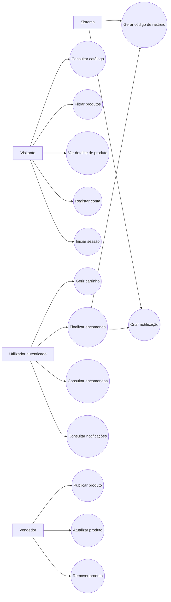
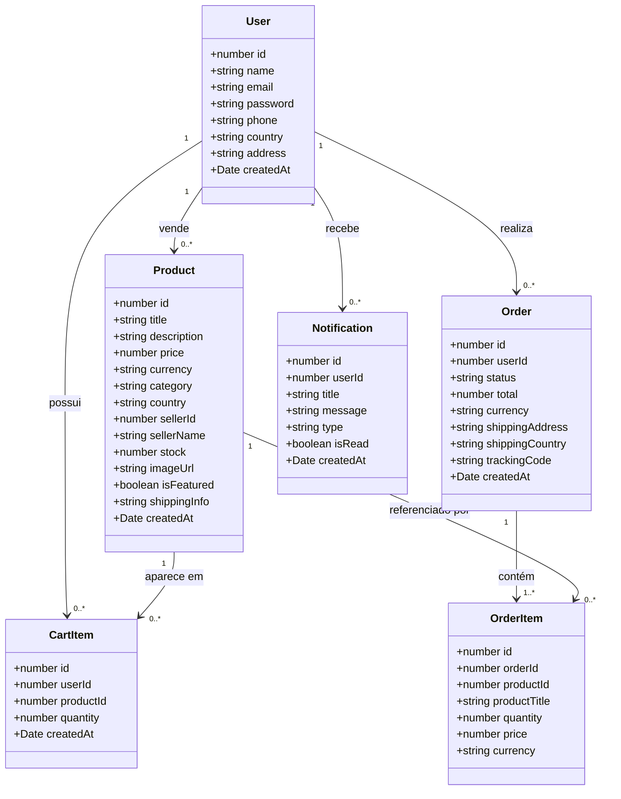
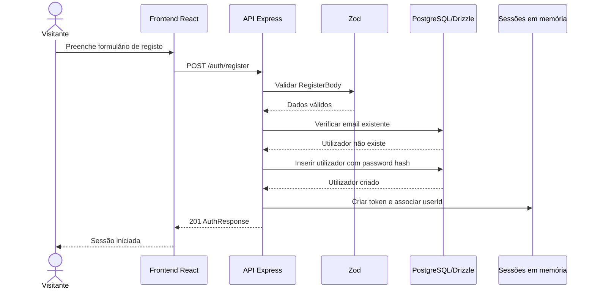
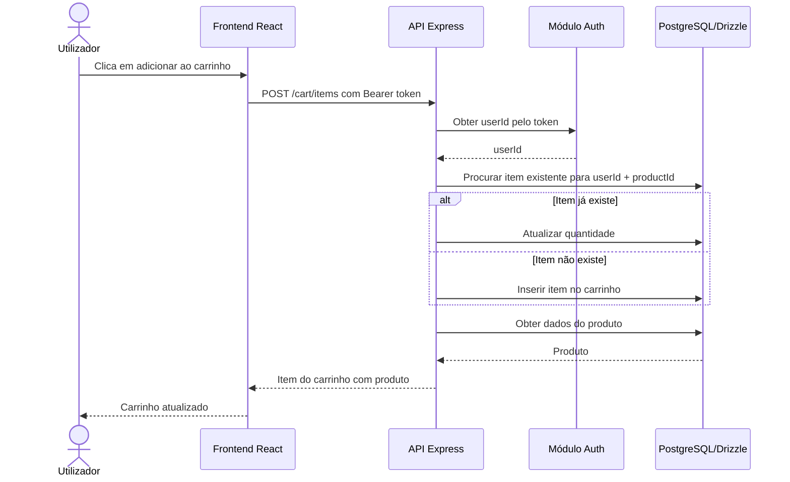
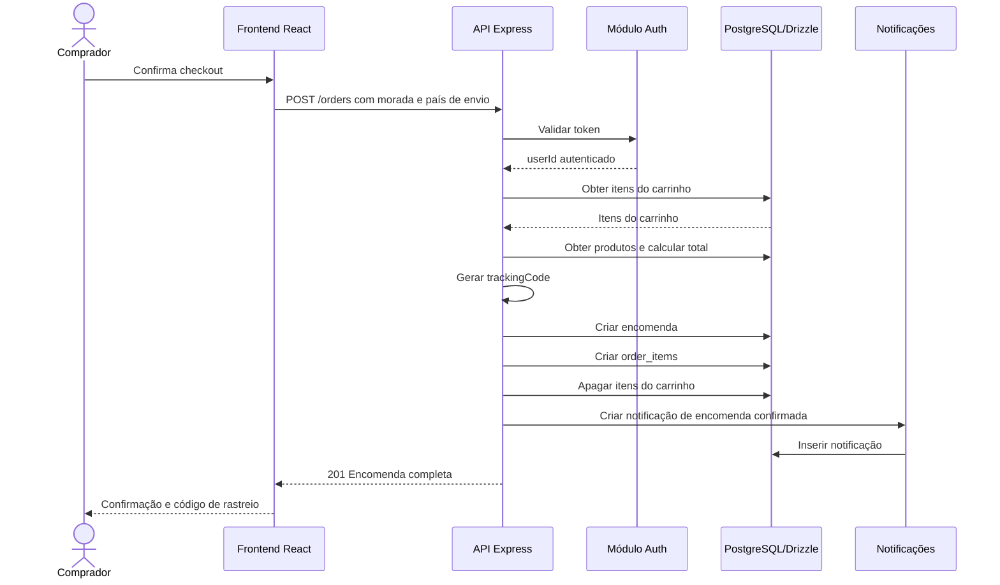
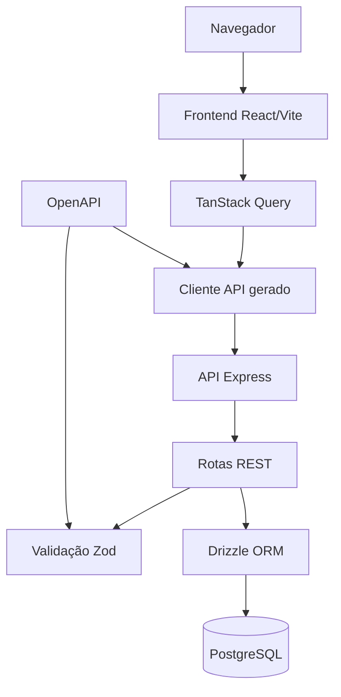

# Relatório Técnico de Análise de Sistemas

## Introdução

Este documento apresenta a análise técnica do sistema desenvolvido no projeto, uma aplicação de marketplace global para compra e venda de produtos. A solução permite a utilizadores registarem-se, autenticarem-se, consultar produtos, filtrar o catálogo, adicionar artigos ao carrinho, finalizar encomendas, acompanhar pedidos e receber notificações.

O projeto encontra-se organizado em subprojetos com frontend, API, especificação OpenAPI, cliente gerado, validação Zod e camada de persistência com PostgreSQL e Drizzle ORM. Esta estrutura separa responsabilidades e facilita a manutenção, a evolução da API e a integração entre as diferentes partes da aplicação.

## Análise de Contexto

O sistema responde à necessidade de uma plataforma digital onde compradores e vendedores possam interagir de forma simples. O comprador precisa de encontrar produtos por categoria, país, preço ou pesquisa textual, gerir um carrinho e concluir compras. O vendedor precisa de publicar produtos com preço, stock, imagem, categoria, país e informação de envio.

Os principais intervenientes são:

- Visitante: consulta páginas públicas, produtos em destaque e detalhes de produtos.
- Utilizador autenticado: gere carrinho, cria encomendas, consulta histórico e notificações.
- Vendedor: cria, atualiza e remove produtos.
- Sistema: valida dados, gere sessão, calcula totais, gera códigos de rastreio e regista notificações.
- Base de dados: persiste utilizadores, produtos, carrinho, encomendas e notificações.

O projeto utiliza uma arquitetura web cliente-servidor. O frontend comunica com a API através de endpoints REST definidos por OpenAPI. A API aplica regras de negócio, valida os pedidos com Zod e persiste informação numa base de dados PostgreSQL usando Drizzle ORM.

## Requisitos Funcionais e Não Funcionais

### Requisitos Funcionais

| Código | Requisito |
| --- | --- |
| RF01 | Permitir o registo de novos utilizadores com nome, email, palavra-passe, telefone, país e morada opcional. |
| RF02 | Permitir login e logout através de token de sessão. |
| RF03 | Permitir consultar o utilizador autenticado. |
| RF04 | Listar produtos disponíveis no marketplace. |
| RF05 | Filtrar produtos por país, categoria, texto de pesquisa, preço mínimo e preço máximo. |
| RF06 | Apresentar produtos em destaque. |
| RF07 | Apresentar categorias disponíveis e respetiva contagem de produtos. |
| RF08 | Permitir consultar o detalhe de um produto. |
| RF09 | Permitir a criação de produtos por utilizadores autenticados. |
| RF10 | Permitir atualizar e eliminar produtos. |
| RF11 | Permitir adicionar produtos ao carrinho. |
| RF12 | Permitir consultar, alterar quantidades e remover itens do carrinho. |
| RF13 | Permitir criar uma encomenda a partir dos itens existentes no carrinho. |
| RF14 | Calcular o total da encomenda a partir dos preços e quantidades dos produtos. |
| RF15 | Gerar código de rastreio para encomendas confirmadas. |
| RF16 | Limpar o carrinho após a criação da encomenda. |
| RF17 | Criar notificação após confirmação de encomenda. |
| RF18 | Permitir consultar encomendas e detalhe de encomenda do utilizador autenticado. |
| RF19 | Permitir consultar notificações do utilizador. |
| RF20 | Permitir marcar notificações como lidas individualmente ou em conjunto. |

### Requisitos Não Funcionais

| Código | Requisito |
| --- | --- |
| RNF01 | A aplicação deve separar frontend, API, contratos e base de dados em módulos independentes. |
| RNF02 | A API deve validar dados de entrada antes de executar operações de negócio. |
| RNF03 | O sistema deve proteger endpoints privados através de autenticação por token. |
| RNF04 | A base de dados deve garantir persistência dos dados principais do domínio. |
| RNF05 | A aplicação deve usar TypeScript para reduzir erros de integração e tipagem. |
| RNF06 | Os contratos da API devem ser descritos em OpenAPI para facilitar geração de clientes e validações. |
| RNF07 | A interface deve ser responsiva e navegável através de rotas dedicadas. |
| RNF08 | O sistema deve disponibilizar endpoint de saúde para verificação operacional. |
| RNF09 | A aplicação deve ser modular para permitir evolução de funcionalidades como pagamentos, administração ou logística. |
| RNF10 | O código deve permitir execução local com pnpm workspaces, Node.js, Express, Vite e PostgreSQL. |

## Casos de Uso

### Diagrama de Casos de Uso

### Descrição Resumida dos Casos de Uso

| Caso de Uso | Ator Principal | Descrição |
| --- | --- | --- |
| Consultar catálogo | Visitante | Lista produtos disponíveis no marketplace. |
| Filtrar produtos | Visitante | Aplica filtros de país, categoria, pesquisa e intervalo de preço. |
| Ver detalhe de produto | Visitante | Consulta informação completa de um produto. |
| Registar conta | Visitante | Cria uma conta de utilizador. |
| Iniciar sessão | Visitante | Autentica-se e recebe token de sessão. |
| Gerir carrinho | Utilizador | Adiciona, remove e altera quantidades de produtos. |
| Finalizar encomenda | Utilizador | Cria uma encomenda a partir do carrinho. |
| Consultar encomendas | Utilizador | Visualiza histórico e detalhe de encomendas. |
| Consultar notificações | Utilizador | Visualiza e marca notificações como lidas. |
| Publicar produto | Vendedor | Cria uma nova listagem de produto. |
| Atualizar produto | Vendedor | Edita dados de um produto existente. |
| Remover produto | Vendedor | Remove uma listagem do marketplace. |

## User Stories

| ID | User Story | Critérios de Aceitação |
| --- | --- | --- |
| US01 | Como visitante, quero ver produtos disponíveis para perceber o que posso comprar. | A página de produtos apresenta uma lista de artigos com preço, país, categoria e imagem quando disponível. |
| US02 | Como visitante, quero filtrar produtos para encontrar rapidamente artigos relevantes. | O sistema aceita filtros por país, categoria, pesquisa e intervalo de preço. |
| US03 | Como visitante, quero criar conta para poder comprar e gerir encomendas. | O sistema valida os dados e impede registo com email já existente. |
| US04 | Como utilizador, quero iniciar sessão para aceder às funcionalidades privadas. | Após login válido, o sistema devolve um token e dados do utilizador. |
| US05 | Como comprador, quero adicionar produtos ao carrinho para preparar uma compra. | Se o produto já existir no carrinho, a quantidade é incrementada. |
| US06 | Como comprador, quero alterar quantidades no carrinho para controlar a encomenda. | O sistema atualiza apenas itens pertencentes ao utilizador autenticado. |
| US07 | Como comprador, quero finalizar uma encomenda para comprar os produtos selecionados. | O sistema calcula total, cria encomenda, cria itens, limpa carrinho e gera rastreio. |
| US08 | Como comprador, quero consultar encomendas para acompanhar o meu histórico. | A API devolve apenas encomendas do utilizador autenticado. |
| US09 | Como utilizador, quero receber notificações para saber quando uma encomenda é confirmada. | Após criação de encomenda, é registada uma notificação do tipo order. |
| US10 | Como vendedor, quero publicar produtos para vendê-los no marketplace. | O sistema associa o produto ao utilizador autenticado como vendedor. |
| US11 | Como vendedor, quero atualizar produtos para corrigir preço, stock ou descrição. | A API permite alterações parciais dos campos do produto. |
| US12 | Como vendedor, quero remover produtos para retirar listagens indisponíveis. | A API remove o produto e devolve mensagem de confirmação. |

## Diagramas de Classe

O diagrama seguinte representa as principais entidades persistidas e as suas relações lógicas. A implementação atual usa tabelas Drizzle sem declaração explícita de foreign keys, mas os campos `userId`, `sellerId`, `productId` e `orderId` expressam as associações de domínio.

## Diagramas de Sequência

### Registo e Login

### Adicionar Produto ao Carrinho

### Finalização de Encomenda

## Descrição da Arquitetura da Aplicação

A arquitetura segue uma divisão por camadas e pacotes:

- Frontend: aplicação React com Vite, Wouter para rotas, TanStack Query para estado assíncrono e componentes UI reutilizáveis.
- API: servidor Express 5 com rotas REST para autenticação, produtos, carrinho, encomendas, notificações e health check.
- Contrato: especificação OpenAPI que descreve endpoints, schemas e respostas esperadas.
- Cliente gerado: código gerado por Orval para facilitar chamadas à API e manter alinhamento com o contrato.
- Validação: schemas Zod gerados/partilhados para validar bodies, parâmetros e queries.
- Persistência: PostgreSQL com Drizzle ORM, contendo tabelas de users, products, cart_items, orders, order_items e notifications.

### Diagrama de Componentes

### Organização Técnica

O frontend define páginas para início, listagem de produtos, detalhe de produto, carrinho, checkout, encomendas, notificações, venda, login e registo. A navegação é declarada no componente principal da aplicação.

A API agrupa as rotas por domínio:

- `auth`: registo, login, logout e utilizador atual.
- `products`: listagem, filtros, destaque, categorias, detalhe, criação, atualização e remoção.
- `cart`: consulta, adição, atualização e remoção de itens.
- `orders`: criação, listagem e detalhe de encomendas.
- `notifications`: consulta e marcação de notificações como lidas.
- `health`: verificação de disponibilidade.

A camada de dados define as entidades centrais com Drizzle ORM. A utilização de TypeScript em todos os pacotes reduz divergências entre contrato, API, frontend e base de dados.

## Reflexão sobre Competências Adquiridas

O desenvolvimento e análise deste sistema permitem consolidar competências importantes em análise e desenvolvimento de sistemas:

- Levantamento de requisitos funcionais e não funcionais a partir de funcionalidades implementadas.
- Identificação de atores, casos de uso e fluxos principais de negócio.
- Modelação de entidades e relações através de diagramas de classe.
- Representação de interações entre utilizador, frontend, API e base de dados com diagramas de sequência.
- Compreensão de arquitetura cliente-servidor e separação por camadas.
- Utilização de contratos OpenAPI para documentar e alinhar frontend e backend.
- Aplicação de validação de dados com Zod antes da persistência.
- Integração de PostgreSQL com Drizzle ORM.
- Implementação de autenticação baseada em token e controlo de acesso a endpoints privados.
- Organização modular de um projeto TypeScript com workspaces.

Também se destacam competências de pensamento sistémico: a encomenda, por exemplo, não é apenas uma inserção na base de dados; envolve autenticação, leitura do carrinho, cálculo de total, criação de linhas de encomenda, limpeza do carrinho e emissão de notificação. Esta visão integrada é essencial para desenhar sistemas consistentes.

## Conclusão

O sistema analisado apresenta uma base sólida para um marketplace global, com funcionalidades essenciais de catálogo, autenticação, carrinho, encomendas e notificações. A separação entre frontend, API, contrato, validação e persistência torna a aplicação mais organizada e preparada para evolução.

Como melhorias futuras, recomenda-se reforçar a segurança da autenticação, substituir sessões em memória por armazenamento persistente, adicionar controlo de permissões específico para vendedores, declarar relações formais na base de dados, introduzir testes automatizados e preparar integração com pagamentos e serviços reais de envio.

De forma geral, a aplicação demonstra uma estrutura coerente para um sistema web moderno e permite aplicar conceitos centrais de análise de sistemas, modelação, arquitetura e implementação full-stack.
